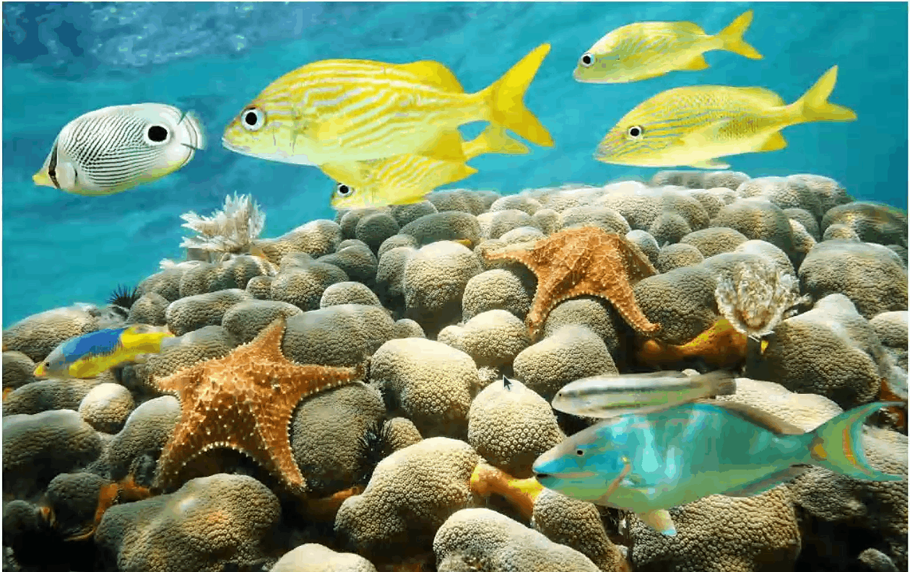
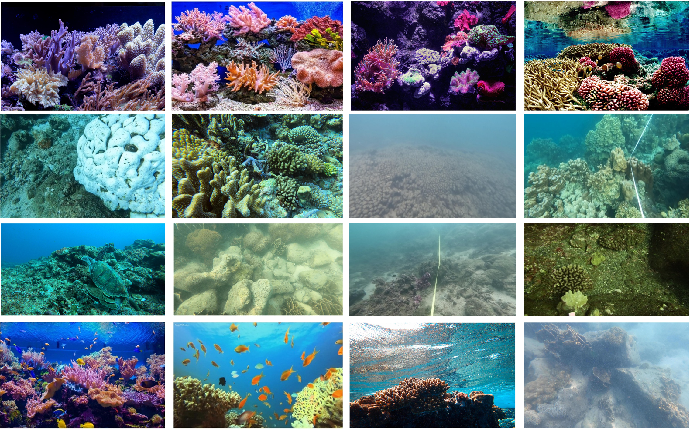

# UCS-Expert
This is the official repository for UCS-Expert: Fine-Grained Segmentation for Any Underwater Coral Imagery.

## We provide a simple tool for interactively segment coral images


## various corals


## Getting Started

Download the [model checkpoint](https://drive.google.com/xxx) and place it at `checkpoint/ucs_b.pth`:

```bash
mkdir -p checkpoint
```

### Environmental Setups
Our code is developed on Ubuntu 20.04 using Python 3.10 and PyTorch 2.5 with CUDA 12.1.

```bash
git clone https://github.com/Linzy0227/UCS-Expert.git
cd UCS-Expert
conda env create -f environment.yml
conda activate ucs
```

We provide two ways to quickly test the model on your images

1. Command line

```bash
bash test.sh  # segment the demo images
```

2. GUI

`PyQt5` is included in `environment.yml`. It can also be installed separately with `pip install PyQt5`.

```bash
python3 gui.py
```

Load the image to the GUI and specify segmentation targets by drawing bounding boxes.


### Preparing Datasets and the SAM Checkpoint
To validate the performance of coral segmentation, we have provided the [coralscape](https://huggingface.co/datasets/EPFL-ECEO/coralscapes), [corals](https://github.com/YcShentu/CoralSegmentation) and [coralmask](https://docs.google.com/forms/d/e/1FAIpQLSc8qHFBwhsJS_46hqS42NHN-3OqD5GSwvv4Sb36njdrb3LI7g/viewform) datasets. 
Create a `dataset` folder, then download and extract the three datasets into it.

```bash
mkdir dataset
# download and move the zip files into the folder
```
Download the ViT-B SAM checkpoint from this [link](https://dl.fbaipublicfiles.com/segment_anything/sam_vit_b_01ec64.pth) and place it in `sam_ckp`.
```bash
mkdir -p sam_ckp
wget -P sam_ckp https://dl.fbaipublicfiles.com/segment_anything/sam_vit_b_01ec64.pth
```
Finally the file structure is organized as:
```
UCS-Expert
├── dataset
│   ├── CoralMask
│   |   ├── train
│   |   |   ├── images
│   |   |   ├── masks
│   |   ├── test
│   |   |   ├── images
│   |   |   ├── masks
│   ├── CoralS
│   |   ├── test
│   |   |   ├── images
│   |   |   ├── masks
│   ├── CoralScape
│   |   ├── test
│   |   |   ├── images
│   |   |   ├── masks
├── sam_ckp
│   ├── sam_vit_b_01ec64.pth
└── other codes...
```

### Training

```bash
# for single GPU
bash train.sh
```
Then you can find checkpoints and training logs in `work_dir/UCS-Expert`.

To use a different dataset location without editing the script:

```bash
DATA_PATH=/path/to/CoralMask bash train.sh
```


## Acknowledgements
- We highly appreciate all the dataset owners for providing the public dataset to the community.
- We thank Meta AI for making the source code of [segment anything](https://github.com/facebookresearch/segment-anything) publicly available.
